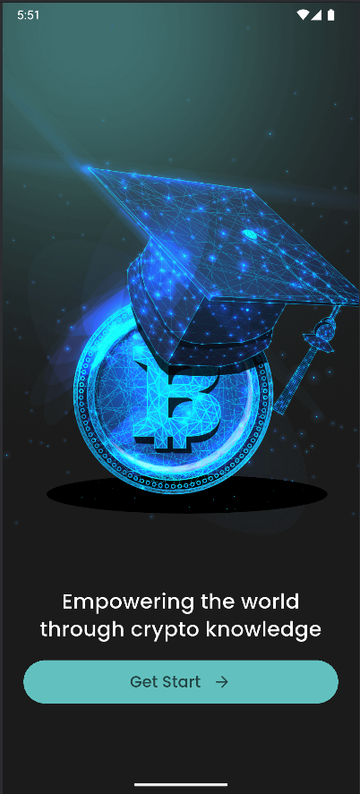
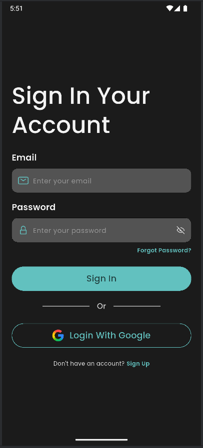
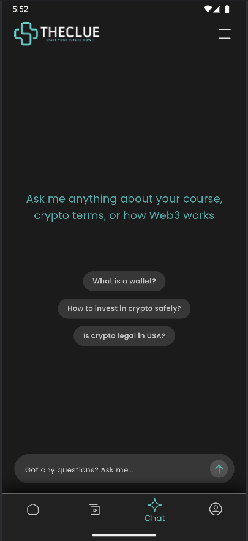

Absolutely! Here’s a polished README tailored for your **Crypto Education App**, following the style and clarity of the Chakra Quiz example:

---

# 💰 Crypto Education App

A modern **Crypto Learning Application** built with **Flutter** for a smooth cross-platform experience, powered by a **Django REST API backend**, and managed with **GetX** for state management and navigation.
Designed to help users **learn, track, and stay updated** on cryptocurrency knowledge, markets, and news.

---

## ✨ Features

* 📚 Explore comprehensive crypto educational content
* 🎓 Track learning progress with quizzes and lessons
* 📊 Real-time crypto data display (optional market integration)
* 📰 News and updates for popular cryptocurrencies
* 🔔 Notification system for new courses or updates
* 🔐 Secure authentication and user profiles
* 🎨 Beautiful, responsive, and interactive UI
* ⚡ Fast, reactive navigation with GetX
* 💾 Local data caching with SharedPreferences
* 🧹 Clean, modular, and scalable architecture

---

## 📱 Screenshots

|              Splash Screen               |             Auth Screen              |            Ai Chat Screen            |
|:----------------------------------------:|:------------------------------------:|:------------------------------------:|
|  |  |  |

---

## 🛠️ Built With

* **Flutter** — Cross-platform app framework
* **Django REST Framework** — Backend API
* **GetX** — State Management & Routing
* **SharedPreferences** — Local data caching
* **Dart** — Frontend programming language
* **Python** — Backend programming language

---

## 🧩 Architecture Overview

```plaintext
lib/
├── controllers/      # GetX controllers for quizzes, notifications, and user profile
├── models/           # Data models (User, Notification, Topic, Quiz)
├── services/         # API and local storage services
├── views/            # Screens and reusable widgets
├── utils/            # Themes, constants, and helper functions
└── main.dart         # App entry point
```

> The backend lives in a separate Django project, exposing REST APIs for authentication, lessons, quizzes, notifications, and user management.

---

## 🚀 Getting Started

Follow these steps to run the project locally:

### 1. **Clone the repository**

```bash
git clone https://github.com/S4K1L/Crypto-Education.git
cd Crypto-Education
```

### 2. **Install Flutter dependencies**

```bash
flutter pub get
```

### 3. **Setup Django Backend**

* Clone or open the Django backend repo (if separate).
* Install dependencies:

```bash
pip install -r requirements.txt
```

* Run migrations & start server:

```bash
python manage.py migrate
python manage.py runserver
```

* Default API runs at: `http://127.0.0.1:8000/api/`

### 4. **Connect Flutter app to backend**

Update your API base URL in `services/api_service.dart`.

### 5. **Run the app**

```bash
flutter run
```

---

## 🔑 Environment Configuration

* Keep API endpoints, keys, and secrets secure.
* Use `.env` files or packages like `flutter_dotenv` for environment management.

---

## 📈 Future Improvements

* 📊 Real-time market data and price alerts
* 🎓 Interactive quizzes with scoring and progress tracking
* 🌐 Multi-language support
* 🔔 Push notifications for lessons or news
* 🎨 Dark Mode and UI themes

---

## 🤝 Contributing

Contributions are welcome! 🎉
Please fork this repository, create a feature branch, and submit a pull request.

```bash
# Create a feature branch
git checkout -b feature/YourFeature

# Commit your changes
git commit -m 'Add some feature'

# Push to the branch
git push origin feature/YourFeature
```

---

## 📄 License

This project is licensed under the [MIT License](LICENSE).

---

## 💬 Connect with Me

* [LinkedIn](https://www.linkedin.com/in/s4k1l)
* [GitHub](https://github.com/S4K1L)

---

> **Crafted with 💎 knowledge and care using Flutter, Django, and GetX.**

---